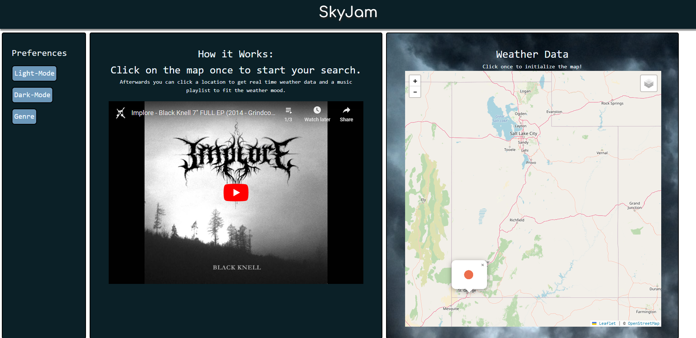

# SkyJam

## Description

This is an application that mixes OpenWeather API and YouTube API to upload a music playlist based on the weather.

## User Story

```md
As a USER looking for a music playlist
I WANT to be able to listen to music based on the weather
SO THAT I can listen to different music depending on the weather
```

## Acceptance Criteria

```md
GIVEN a webpage that uses weather APIs and YouTube APIs to upload music playlist
WHEN I view the webpage
THEN I see great UI/UX design
WHEN I click on the map
THEN I see a weather icon appear of the current weather
WHEN I click on the map
THEN I see a music playlist upload to the left of the map
WHEN I click play on the uploaded playlist
THEN I can listen to the music
```

## Mock Up



## Usage

When you open the app, you will see a map which is interactive. Once you click on the map it will show you the current weather of that location and populate the youtube playlist to the left of it. From there you can enjoy listening to music brought to you by SkyJam.

## Credits

GitHub
- BradenKim22
- EthanMillet
- J3rkStore
- magjoker
- MrBrandtCox

Photo used in PicoCSS version of the site by Tobias Bjørkli: 
https://www.pexels.com/photo/aurora-borealis-and-sun-visible-in-sky-of-northern-norway-11180711/

## Instalation

N/A

## Deployment

Follow the link for the application https://j3rkstore.github.io/weatheringo/

## License

Please refer to the LICENSE in the repo.
