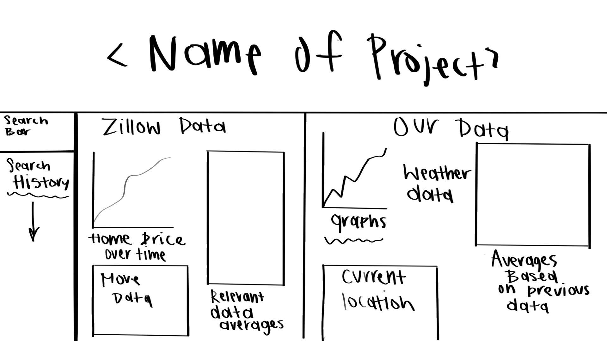
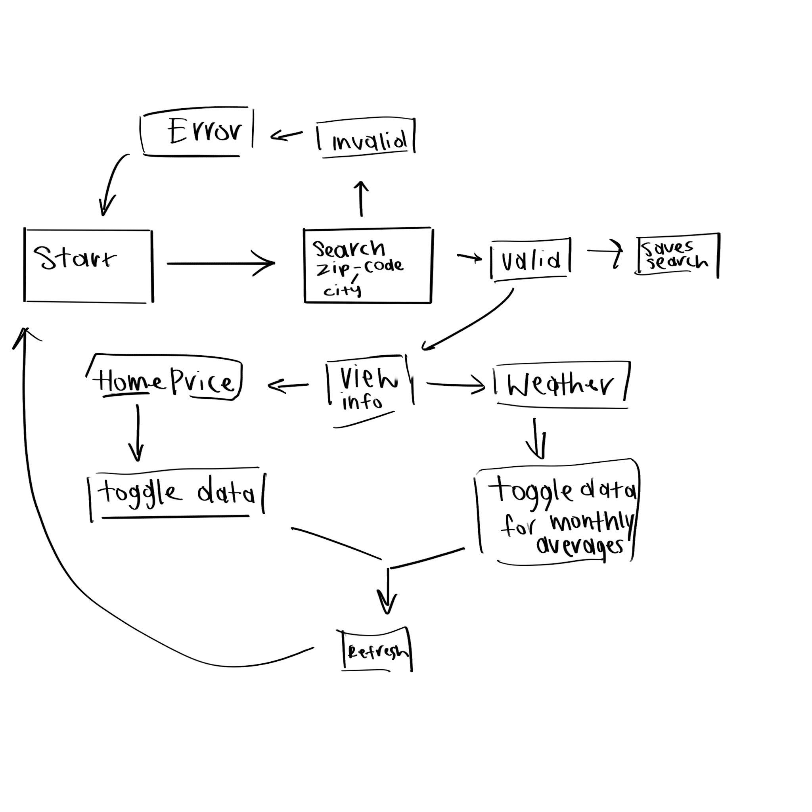

# BEST NEST

## User Story

as a person interested in buying a home

I would like to enter a zip code and see the area average home prices and average weather

so that I can make an informed decision in the real estate market

## user flow diagram:

### search bar:

input zip code and return a city name (later open up to other inputs)

lay out search history below (stored in localStorage)

after selection shows

### home price data

graph of average home prices in a graph over 10 years

move data

relevant data averages

### shows weather data:

average temperature, precipitation, air quality, humidity by month (pulled over 10 year period)
